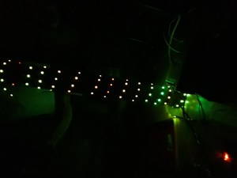
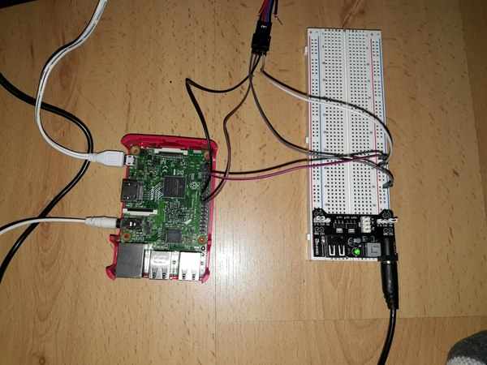

## Have Fun With Led Strip !

What can we do with 4 meters of LEDs (32 leds/m) and raspberry pi ?

My steps:

1- Connect and control leds with raspberry -> Done

2- Leds will react according to music playing on raspberry -> Done

3- Raspberry will also output the music -> Done

4- The music will come from Spotify stream -> Done

5- What about a spectrum analyzer ?

I'm a real newbie in this field, here is my first approach.
_Feel free to comment/create issue!_

__This README is a draft__

### Results (for now)

__Images:__






__Videos:__

[Small video](http://sendvid.com/tpxvd1zb)


### Which existing tools can help me ?

* WS2801 RGB LED : leds strip
* Raspberry pi 3
* [Mopidy](https://www.mopidy.com/) : music server, Spotify enabled
* [BiblioPixel](https://github.com/ManiacalLabs/BiblioPixel) : Python library for programming light animation
* [Lightshowpi](http://lightshowpi.org/) : a wonderful code to make your light dance to music with raspberry
* [Raspbian](https://www.raspberrypi.org/downloads/raspbian/) : debian distribution for raspberry pi


### What i needed

* WS2801 RGB LED : [there](https://www.amazon.fr/gp/product/B06ZZZYHBQ)
* Some wires 
* Solderless breadboard
* Breadboard Power supply module
* Power supply 5V

### Assumption

* Raspbian is installed
* Direct / remote access to raspberry


### Music server

Mopidy is very easy to install. See documentation on website. I also installed the [mopidy-spotify](https://github.com/mopidy/mopidy-spotify). Mopidy is running as a service and launch a webserver on 192.168.XX.XX where [iris](https://github.com/jaedb/iris) is installed.

My conf file is in `mopidy/mopidy.conf`. Notice Alsa chunk.

I also  updates the service file because the service wasn't waiting for internet :

```
do_start()
{
    if [ ! -d /var/cache/mopidy ]; then
        mkdir -p /var/cache/mopidy
        chown mopidy:audio /var/cache/mopidy
    fi

    ## my modification ...
    sleep 30

    start-stop-daemon --start --quiet --name $NAME --pidfile $PIDFILE \
        --startas $DAEMON --test > /dev/null \
        || return 1
    start-stop-daemon --start --quiet --name $NAME --pidfile $PIDFILE \
        --chuid $DAEMON_USER:$DAEMON_GROUP --background --make-pidfile \
        --startas $DAEMON -- --quiet --config $CONFIG_FILES \
        || return 2
}
```


### Lightshowpi

Lightshow is really amazing. You can easily, without deep knowledges, create something nice with music and lights. 
To install lighshowpi use official bitbucket repo.

My goal was to use the _audio-in_ method : the output of mopidy must be the input of lightshowpi AND raspberry outputs the sound.

In order to make this work, you need to create a loopback device with ALSA (next section).

Lightshowpi is writtent in python, i updates the `py/synchronized_lights.py` for my purposes :

* make lightshowpi a service :

add shebang

```
#!/usr/bin/env python
```

need to initialize variables:

```
os.environ["SYNCHRONIZED_LIGHTS_HOME"] = "/home/pi/lightshowpi"
HOME_DIR = os.getenv("SYNCHRONIZED_LIGHTS_HOME")
```

create a file `init.d/lightshowpi` added to systemctl.

* handle an error from audioop

Happens when lighshowpi is "recording" and music is played after

```
try:
    audio_max = audioop.max(data, 2)
except audioop.error:
    audio_max = 0
    continue
```


### ALSA

Why Alsa ? Always liked it, no more reason.

OK, the issue was to make recordable the sound coming from alsa card. I found on the web two solutions:

First of all, you need to enable the aloop module : `modprobe snd-aloop` and make it available on start.


* 1)

See `alsa/asound.conf.card`.
This solution turns out to work with usb card, but not with raspberry alsa card. (_dmix_ seems not to work there)


* 2)

See  `alsa/asound.conf`
This solution works with raspberry alsa card.

It creates a virtual recording card called _looprec_.


__My Own Question:__

* It seems that i needed to mix the sound (rate, buffer size, ...) of looprec. Is it necessary ?
* Volume control acts on the volume lightshowpi receive in the second solution ?


### Wires

Documentation found [here](https://tutorials-raspberrypi.com/how-to-control-a-raspberry-pi-ws2801-rgb-led-strip/)

__My Own Question:__

* For some reason i was not able to start my raspberry with 5V. So i supply the raspberry with 3.3V (micro usb), and the led strip with 5V. Do i still need to connect the raspberry ground pin to the ground of breaboard ? 


### Bibliopixel

TODO


### Random docs

https://www.alsa-project.org/alsa-doc/alsa-lib/pcm_plugins.html
https://raspberrypi.stackexchange.com/questions/57787/using-the-alsa-dmix-plugin-on-raspbian-jessie/61974
https://www.raspberrypi.org/forums/viewtopic.php?t=64936&p=481557
https://bbs.archlinux.org/viewtopic.php?id=147852
https://alsa.opensrc.org/Dsnoop

https://docs.python.org/2/library/audioop.html 


